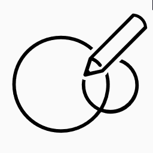

[](https://crowdin.com/project/darklinkpower-playnite-extensi)
# Playnite Extensions Collection

Collection of extensions made for [Playnite](https://github.com/JosefNemec/Playnite).

## Questions, suggestions and Issues

Please open a [new Issue](https://github.com/darklinkpower/PlayniteScriptExtensions/issues) to report issues or request features.

Please also be aware that I don't visite the Playnite forums frequenty so if you need help or have a question, I'm more easily found in the [Playnite Discord server](https://discord.gg/BrtABqe "Playnite Discord server")

## Download and installation

Option A. Click the `Install` link of the extension in the table.

Option B. Click the `Database` link of the extension in the table to go to the addon entry in the Playnite database and then click the `Download` button in the entry.

Option C. Download directly from Playnite in the addons browser.

## Usage

Varies depending the extension functionality but in general. Refer to each extension thread in Playnite forums for the specific instructions.

## Extensions

### Generic

|Icon⠀⠀|Name|Description|Database|Forums|Install|Help|
| ------------ | ------------ | ------------ | ------------ | ------------ | ------------ | ------------ |
|  | Cooperative Modes Importer | Detects and adds features that indicate the cooperative features in games. | [Database](https://playnite.link/addons.html#CooperativeModesImporter_9767ac15-6e26-4e4c-9d69-f6838625dde3 "Database") | [Forums](https://playnite.link/forum/thread-1101.html "Forums") | [Install](https://tinyurl.com/yw8wpnyc "Install") | None |
|  | Date Importer | This extension will obtain the date of when the Epic, GOG and Steam games in your account where bought by obtaining them from the license date. | [Database](https://playnite.link/addons.html#Date_Importer_d0e7fb90-e74e-4955-b7bc-43a13339637e "Database") | [Forums](https://playnite.link/forum/thread-376.html "Forums") | [Install](https://tinyurl.com/2p8jpcur "Install") | None |
|  | Extra Metadata Loader | Adds functionality to support logos and videos media in compatible custom themes. | [Database](https://playnite.link/addons.html#ExtraMetadataLoader_705fdbca-e1fc-4004-b839-1d040b8b4429 "Database") | [Forums](https://playnite.link/forum/thread-814.html "Forums") | [Install](https://tinyurl.com/4kczrbd3 "Install") | [Help](../../wiki/Extra-Metadata-Loader "Help") |
|  | Extra Metadata Fullscreen Mode Helper | Adds support for 'Extra Metadata Loader' extension usage in certain Fullscreen Mode themes | [Database](https://playnite.link/addons.html#Extra_Metadata_tools_2e0349ed-6da2-4095-9457-4c9fb544551e "Database") | [Forums](https://playnite.link/forum/thread-575.html "Forums") | [Install](https://tinyurl.com/2p9sk8pw "Install") | None |
|  | Game Engine Checker | This extension will add a tag with the name of the engine used by the game. It's compatible with PC games that are available on GOG or Steam.  The information is obtained from PCGamingWiki. | [Database](https://playnite.link/addons.html#Game_Engine_Checker_7a21243e-c7cc-4ca7-85bd-f6f96f22e9db "Database") | [Forums](https://playnite.link/forum/thread-505.html "Forums") | [Install](https://tinyurl.com/te75rx5v "Install") | None |
|  | Game Media Tools | This extension is intended as a library mantaining tool and to make it easier to handle game media in your library. | [Database](https://playnite.link/addons.html#Game_Media_Tools "Database") | [Forums](https://playnite.link/forum/thread-313.html "Forums") | [Install](https://tinyurl.com/yd7rfvb5 "Install") | None |
|  | Game Pass Catalog Browser | Browse the Game Pass catalog in Playnite and add its game to your Playnite library. | [Database](https://playnite.link/addons.html#GamePassCatalogBrowser_50c85177-570f-4494-be16-99d6aa5b8a93 "Database") | [Forums](https://playnite.link/forum/thread-716.html "Forums") | [Install](https://tinyurl.com/45bc3uhr "Install") | None |
|  | Games Size Calculator | Calculates the size games use on disk in GB and sets it to the Version field so the info can be viewed and sorted. | [Database](https://playnite.link/addons.html#GamesSizeCalculator_97cc59db-3f80-4852-8bfc-a80304f9efe9 "Database") | [Forums](https://playnite.link/forum/thread-1096.html "Forums") | [Install](https://tinyurl.com/2ccet332 "Install") | None |
|  | Image Cache Size Saver | Extension to process the images in your Playnite images cache directory to save space. | [Database](https://playnite.link/addons.html#Image_Cache_Size_Saver "Database") | [Forums](https://playnite.link/forum/thread-372.html "Forums") | [Install](https://tinyurl.com/yc55xrwr "Install") | None |
|  | Installation Status Updater | This extension updates the installation status of your games automatically by detecting if the game files are present. | [Database](https://playnite.link/addons.html#Installation_Status_Updater "Database") | [Forums](https://playnite.link/forum/thread-316.html "Forums") | [Install](https://tinyurl.com/2p8hu5bj "Install") | None |
|  | Links Sorter | Simple extension that sorts the links of selected or all games in database by URL in ascending order (From A to Z, 0 to 9). | [Database](https://playnite.link/addons.html#Links_Sorter "Database") | [Forums](https://playnite.link/forum/thread-401.html "Forums") | [Install](https://tinyurl.com/rrw7t9vx "Install") | None |
|  | Log Open | Simple extension that will open your Playnite log file. | [Database](https://playnite.link/addons.html#Log_Open_a755c30f-580a-491e-9584-6c5314f6e254 "Database") | [Forums](https://playnite.link/forum/thread-535.html "Forums") | [Install](https://tinyurl.com/t5k9n4fj "Install") | None |
|  | MAME Tools | Collection of tools for MAME games. | [Database](https://playnite.link/addons.html#MameRenamer_be989711-a433-428f-932e-207860c94fc9 "Database") | [Forums](https://playnite.link/forum/thread-495.html "Forums") | [Install](https://tinyurl.com/3srw3huc "Install") | None |
|  | News Viewer | Adds support to display news for Steam games in compatible themes. | [Database](https://playnite.link/addons.html#NewsViewer_15e03ffe-90f6-4e8e-bd4d-94514777481d "Database") | [Forums]( "Forums") | [Install](https://tinyurl.com/56z3z78v "Install") | [Help](../../wiki/News-Viewer "Help") |
|  | Nexus Mods checker | This extension will add a feature named "Nexus Mods" and add a link to the games mod page to games with mods available on Nexus Mods. | [Database](https://playnite.link/addons.html#Nexus_Mods_Checker_ece2874c-be52-4a64-b178-ed379a042f85 "Database") | [Forums](https://playnite.link/forum/thread-533.html "Forums") | [Install](https://tinyurl.com/4ff7s8dw "Install") | None |
|  | NVIDIA Freestyle checker | This extension will add a feature named "NVIDIA Freestyle" to NVIDIA Freestyle supported games in your library. | [Database](https://playnite.link/addons.html#NVIDIA_Freestyle_Checker "Database") | [Forums](https://playnite.link/forum/thread-503.html "Forums") | [Install](https://tinyurl.com/3ksrp58j "Install") | None |
|  | NVIDIA GeForce NOW Enabler | Plugin for Playnite that checks for games enabled in the NVIDIA GeForce NOW service that are in your library. | [Database](https://playnite.link/addons.html#NVIDIA_GeForce_Now_Enabler "Database") | [Forums](https://playnite.link/forum/thread-298.html "Forums") | [Install](https://tinyurl.com/5du3prcv "Install") | None |
|  | NVIDIA GE GameStream Export | This extension will export your selected games to NVIDIA Geforce Experience GameStreaming games database. | [Database](https://playnite.link/addons.html#NVIDIA_GE_GameStream_Export "Database") | [Forums](https://playnite.link/forum/thread-252.html "Forums") | [Install](https://tinyurl.com/2p89xp5e "Install") | None |
|  | PlayState | This extension will let you suspend and resume your game at any moment with the configured hotkey. | [Database](https://playnite.link/addons.html#PlayState "Database") | [Forums](https://playnite.link/forum/thread-225.html "Forums") | [Install](https://tinyurl.com/mrthdz2w "Install") | None |
|  | Resolution Changer | Change the resolution of your main display when starting games. | [Database](https://playnite.link/addons.html#ResolutionChanger_32b6a5c7-be17-4852-b4f7-f059a7321f4c "Database") | [Forums](https://playnite.link/forum/thread-1026.html "Forums") | [Install](https://tinyurl.com/3xs4tfh8 "Install") | None |
|  | Review Viewer | Extension to see Steam reviews, trailers video and review video from within Playnite. | [Database](https://playnite.link/addons.html#Review_Viewer_ca24e37a-76d9-49bf-89ab-d3cba4a54bd1 "Database") | [Forums](https://playnite.link/forum/thread-550.html "Forums") | [Install](https://tinyurl.com/ycy827hp "Install") | [Help](../../wiki/Review-Viewer "Help") |
|  | Save File View | This extension will open the save or configuration directories of your games. | [Database](https://playnite.link/addons.html#SaveFileView_f68f302b-9799-4b77-a982-4bfca97130e2 "Database") | [Forums](https://playnite.link/forum/thread-691.html "Forums") | [Install](https://tinyurl.com/2p97b4xs "Install") | None |
|  | Search Collection | This extension will search the currently selected game(s) on different websites in your web browser. | [Database](https://playnite.link/addons.html#Search_Collection "Database") | [Forums](https://playnite.link/forum/thread-163.html "Forums") | [Install](https://tinyurl.com/y8udsse9 "Install") | None |
|  | Special K Helper |  | [Database](https://playnite.link/addons.html#SpecialKHelper_71349310-9ed8-4bf5-8bf2-e92cdb222748 "Database") | [Forums]( "Forums") | None | None |
|  | Splash Screen | This extension can show an intro video and an image when starting a game. | [Database](https://playnite.link/addons.html#SplashScreen_d8c4f435-2bd2-49d8-98f6-87b1d415934a "Database") | [Forums](https://playnite.link/forum/thread-681.html "Forums") | [Install](https://tinyurl.com/2rc3nnev "Install") | [Help](../../wiki/Splash-Screen "Help") |
|  | Steam Game Importer | Extension to add games from steam with manual input of steam Id or store link and importing a Depressurized file export. | [Database](https://playnite.link/addons.html#Steam_Game_Importer "Database") | [Forums](https://playnite.link/forum/thread-300.html "Forums") | [Install](https://tinyurl.com/4w2drm8d "Install") | None |
|  | Steam Game Transfer Utility | Extension to copy or move Steam games between your different Steam libraries. | [Database](https://playnite.link/addons.html#SteamGameTransferUtility_c2dac2df-44c9-4f47-8555-c8d134c4f400 "Database") | [Forums](https://playnite.link/forum/thread-669.html "Forums") | [Install](https://tinyurl.com/5d6865y7 "Install") | None |
|  | Steam Launcher Utility | This extension allows you to configure the way steam is launched when starting a Steam game in both Playnite Desktop and Fullscreen mode. | [Database](https://playnite.link/addons.html#SteamLauncherUtility_31a65402-5b0c-44f0-9fc2-44b22ca4263c "Database") | [Forums](https://playnite.link/forum/thread-659.html "Forums") | [Install](https://tinyurl.com/28k96f9s "Install") | None |
|  | Steam Tags Importer | This extension will get user tags from the Steam Store for selected games. | [Database](https://playnite.link/addons.html#Steam_Tags_Importer_01b67948-33a1-42d5-bd39-e4e8a226d215 "Database") | [Forums](https://playnite.link/forum/thread-644.html "Forums") | [Install](https://tinyurl.com/yuawyejx "Install") | None |
|  | Steam Trailers | Extension to view trailers from Steam in Playnite. Compatible with Steam games or games that are on the Steam Store. | [Database](https://playnite.link/addons.html#Steam_Trailers "Database") | [Forums](https://playnite.link/forum/thread-242.html "Forums") | [Install](https://tinyurl.com/254x3y2v "Install") | None |
|  | Steam Viewer | This simple extension will add items with functions to open various game pages and steam components directly on Steam from the game right click menu. | [Database](https://playnite.link/addons.html#Steam_Viewer_0a3edabb-065f-4056-a294-d6bc0656e2ac "Database") | [Forums](https://playnite.link/forum/thread-506.html "Forums") | [Install](https://tinyurl.com/yn26t6kv "Install") | None |
|  | Twitch link importer | This extension will add a Twitch Link to your selected games. | [Database](https://playnite.link/addons.html#Twitch_Add_Link "Database") | [Forums](https://playnite.link/forum/thread-364.html "Forums") | [Install](https://tinyurl.com/yc66h6fw "Install") | None |

### Library

|Icon⠀⠀|Name|Description|Database|Forums|Install|Help|
| ------------ | ------------ | ------------ | ------------ | ------------ | ------------ | ------------ |
|  | Importer for Anilist | This plugin imports your anime and manga lists from AniList for viewing in Playnite. | [Database](https://playnite.link/addons.html#ImporterforAnilist_2366fb38-bf25-45ea-9a78-dcc797ee83c3 "Database") | [Forums](https://playnite.link/forum/thread-707.html "Forums") | [Install](https://tinyurl.com/bdd386u4 "Install") | None |

## Themes

**Note:** Themes are listed here just for recopilatory purposes. Each of them have a separate repository that should be used for suggestions and bug reports. To go to the theme repository, click in the theme name.

|Name|Description|Database|Forums|Install|Screenshot|
| ------------ | ------------ | ------------ | ------------ | ------------ | ------------ |
| [Harmony](https://github.com/darklinkpower/Harmony "Harmony") | Clean theme with modern design for Playnite Desktop Mode. | [Database](https://playnite.link/addons.html#Harmony_d49ef7bc-49de-4fd0-9a67-bd1f26b56047 "Database") | [Forums](https://playnite.link/forum/thread-457.html "Forums") | [Install](https://tinyurl.com/4hkbewdh "Install") |  |
| [Helium](https://github.com/darklinkpower/Helium "Helium") | Theme inspired by Steam for Playnite Desktop Mode. | [Database](https://playnite.link/addons.html#8b15c46a-90c2-4fe5-9ebb-1ab25ba7fcb1 "Database") | [Forums](https://playnite.link/forum/thread-811.html "Forums") | [Install](https://tinyurl.com/2s3ja34m "Install") |  |
| [Mythic](https://github.com/darklinkpower/Mythic "Mythic") | Theme inspired by Epic Games Launcher for Playnite Desktop Mode. | [Database](https://playnite.link/addons.html#Mythic_e231056c-4fa7-49d8-ad2b-0a6f1c589eb8 "Database") | [Forums](https://playnite.link/forum/thread-1136.html "Forums") | [Install](https://tinyurl.com/2p9ar9p6 "Install") |  |
| [Stardust](https://github.com/darklinkpower/Harmony "Stardust") | Theme inspired by GOG Galaxy 2.0 for Playnite Desktop Mode. | [Database](https://playnite.link/addons.html#Stardust%202.0_1fb333b2-255b-43dd-aec1-8e2f2d5ea002 "Database") | [Forums](https://playnite.link/forum/thread-468.html "Forums") | [Install](https://tinyurl.com/msj9th4j "Install") |  |

## Contributing

If possible, please contact me before working on a new PR to make sure that the changes are something that we can discuss beforehand.

### General rules
- Indentation must use 4 spaces. No tabs.
- Always encapsulate the code body after *if, for, foreach, while* etc. with curly braces, for example:
```csharp
if (true)
{
    DoSomething();
}
```

### Powershell extensions rules
- Functions names should use approved verbs and format: https://docs.microsoft.com/en-us/powershell/scripting/developer/cmdlet/approved-verbs-for-windows-powershell-commands?view=powershell-5.1
- Cmdlets must be use the full name without abreviations, for example:
```powershell
Get-Service | Where-Object {$_.Status -eq "Stopped"}
```
instead of
```powershell
Get-Service | Where {$_.Status -eq "Stopped"}
```

### C# extensions rules
- Private fields and properties should use camelCase (without underscore)
- All methods (private and public) should use PascalCase
