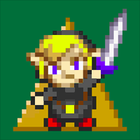
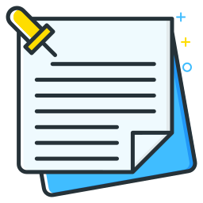

[](https://opensource.org/licenses/MIT)
[](https://crowdin.com/project/darklinkpower-playnite-extensi)
[](https://github.com/darklinkpower/PlayniteExtensionsCollection)
[](https://ko-fi.com/darklinkpower)
[](https://github.com/darklinkpower/PlayniteExtensionsCollection/stargazers)

# Playnite Extensions Collection

A collection of Playnite extensions developed to enhance and customize the experience in [Playnite](https://github.com/JosefNemec/Playnite).

## Table of Contents
- [Tips and Donations](#tips-and-donations)
- [Questions, Suggestions, and Issues](#questions-suggestions-and-issues)
- [Translations](#translations)
- [Download and Installation](#download-and-installation)
- [Usage](#usage)
- [Extensions](#extensions)
- [Contribution Guidelines](#contribution-guidelines)

## Tips and donations
I create Playnite extensions and themes for the love of it—always free for the community.

While donations aren't expected, they're super appreciated! If you've found my work helpful and want to help out, every bit counts and keeps the projects going.

Thanks for considering supporting my Playnite-related work!

<a href='https://ko-fi.com/darklinkpower' target='_blank'></a>

## Questions, suggestions and Issues

If you have a question, suggestion, or encounter an issue, feel free to [open a new Issue](https://github.com/darklinkpower/PlayniteScriptExtensions/issues).

## Translations

You can help to translate the extensions do different languages in the project's [Crowdin page.](https://crowdin.com/project/darklinkpower-playnite-extensi)

## Download and installation

Option A. Click the `Link` of the extension in the table to go to the addon entry in the Playnite database and then click the `Download` button in the entry.

Option B. Download directly from Playnite in the addons browser.

## Usage

Varies depending the extension functionality but in general. Refer to each extension thread in Playnite forums for the specific instructions.

## Extensions

### Generic

|Icon⠀⠀|Name|Description|Database|Help|
| ------------ | ------------ | ------------ | ------------ | ------------ |
|  | Cooperative Modes Importer | Detects and adds features that indicate the cooperative features in games. | [Link](https://playnite.link/addons.html#CooperativeModesImporter_9767ac15-6e26-4e4c-9d69-f6838625dde3 "Database") | [Help](../../wiki/Cooperative-Modes-Importer "Help") |
|  | Covers Collage Maker | Create and export customizable game cover collages from your Playnite library. | [Link](https://playnite.link/addons.html#CoverCollageMaker_7713ea8c-cdec-46ac-b603-6d666515f3da "Database") | N/A |
|  | Details to Grid View Converter | Converts the layout in Details View to Grid View of supported Desktop Mode themes | [Link](https://playnite.link/addons.html#ThemesDetailsViewToGridViewConverter_ef8a7226-eedc-478d-a506-92ee6c088aa3 "Database") | [Help](../../wiki/Details-to-Grid-View-Converter "Help") |
|  | Display Helper | Offers functionality to configure your displays when starting games | [Link](https://playnite.link/addons.html#ResolutionChanger_32b6a5c7-be17-4852-b4f7-f059a7321f4c "Database") | N/A |
|  | Extra Metadata Fullscreen Mode Helper | Adds support for 'Extra Metadata Loader' extension usage in certain Fullscreen Mode themes | [Link](https://playnite.link/addons.html#Extra_Metadata_tools_2e0349ed-6da2-4095-9457-4c9fb544551e "Database") | [Help](../../wiki/Extra-Metadata-Loader "Help") |
|  | Extra Metadata Loader | Adds functionality to support logos and videos media in compatible custom themes. | [Link](https://playnite.link/addons.html#ExtraMetadataLoader_705fdbca-e1fc-4004-b839-1d040b8b4429 "Database") | [Help](../../wiki/Extra-Metadata-Loader "Help") |
|  | Filter Presets Quick Launcher | This extension offers diverse functionality to quickly launch Filter presets from the top panel, sidebar or from Playnite's Search keyboard launcher. | [Link](https://playnite.link/addons.html#FilterPresetsQuickLauncher_ef9df36c-24c2-418c-8468-eed95a09d950 "Database") | N/A |
|  | Game Engine Checker | This extension will add a tag with the name of the engine used by the game. It's compatible with PC games that are available on GOG or Steam.  The information is obtained from PCGamingWiki. | [Link](https://playnite.link/addons.html#Game_Engine_Checker_7a21243e-c7cc-4ca7-85bd-f6f96f22e9db "Database") | N/A |
|  | Game Media Tools | This extension is intended as a library mantaining tool and to make it easier to handle game media in your library. | [Link](https://playnite.link/addons.html#Game_Media_Tools "Database") | N/A |
|  | Game Pass Catalog Browser | Browse the Game Pass catalog in Playnite and add its game to your Playnite library. | [Link](https://playnite.link/addons.html#GamePassCatalogBrowser_50c85177-570f-4494-be16-99d6aa5b8a93 "Database") | [Help](../../wiki/Game-Pass-Catalog-Browser "Help") |
|  | Game Relations | This extension detects and displays other games in your library related to the game that is currently displayed using their metadata in supported themes. | [Link](https://playnite.link/addons.html#GameRelations_a4c15d63-9ab4-4d96-9a0c-8f9b35d43a1f "Database") | N/A |
|  | GOG Second Class Game Watcher | Detects games with missing features or issues on GOG, and adds tagging and display options in Playnite. | [Link](https://playnite.link/addons.html#GOGSecondClassGameWatcher_2661ddac-946a-4fee-ba80-3ece762cb64b "Database") | N/A |
|  | Image Cache Size Saver | Extension to process the images in your Playnite images cache directory to save space. | [Link](https://playnite.link/addons.html#Image_Cache_Size_Saver "Database") | N/A |
|  | Installation Status Updater | This extension updates the installation status of your games automatically by detecting if the game files are present. | [Link](https://playnite.link/addons.html#Installation_Status_Updater "Database") | [Help](../../wiki/Installation-Status-Updater "Help") |
|  | Library Exporter Advanced | Allows to export the Playnite library to a csv file with support to configure what data to export. | [Link](https://playnite.link/addons.html#LibraryExporter_54bf64c6-c453-4cbc-92f8-4960b56f930e "Database") | [Help](../../wiki/Library-Exporter-Advanced "Help") |
|  | Links Sorter | Simple extension that sorts the links of selected or all games in database by URL in ascending order (From A to Z, 0 to 9). | [Link](https://playnite.link/addons.html#Links_Sorter "Database") | N/A |
|  | Log Open | Simple extension that will open your Playnite log file. | [Link](https://playnite.link/addons.html#Log_Open_a755c30f-580a-491e-9584-6c5314f6e254 "Database") | N/A |
|  | MAME Tools | Collection of tools for MAME games. | [Link](https://playnite.link/addons.html#MameRenamer_be989711-a433-428f-932e-207860c94fc9 "Database") | N/A |
|  | Nexus Mods checker | This extension will add a feature named "Nexus Mods" and add a link to the games mod page to games with mods available on Nexus Mods. | [Link](https://playnite.link/addons.html#Nexus_Mods_Checker_ece2874c-be52-4a64-b178-ed379a042f85 "Database") | N/A |
|  | NVIDIA Freestyle checker | This extension will add a feature named "NVIDIA Freestyle" to NVIDIA Freestyle supported games in your library. | [Link](https://playnite.link/addons.html#NVIDIA_Freestyle_Checker "Database") | N/A |
|  | NVIDIA GE GameStream Export | This extension will export your selected games to NVIDIA Geforce Experience GameStreaming games database. | [Link](https://playnite.link/addons.html#NVIDIA_GE_GameStream_Export "Database") | N/A |
|  | Play Notes | This extension provides an UI element with extensive functionality to create and manage notes, including markdown and multiple notes support. | [Link](https://playnite.link/addons.html#PlayNotes_4208657d-4f78-42d2-968f-39f24de275e1 "Database") | N/A |
|  | Playnite Control Locker | This extension provides functionality to help in situations where your Playnite installation is shared with someone else and you want to limit certain functionality for safety reasons. | [Link](https://playnite.link/addons.html#PlayniteControlLocker_e7c39fe7-bec1-4691-a818-b9ba1470ad21 "Database") | N/A |
|  | PlayState | This extension will let you suspend and resume your game at any moment with the configured hotkey. | [Link](https://playnite.link/addons.html#PlayState "Database") | [Help](../../wiki/PlayState "Help") |
|  | Prevent Sleep | Helps prevent the system and screen from sleeping. | [Link](https://playnite.link/addons.html#PreventSleep_d1ccef15-c9aa-4df4-9041-14a2abcb2f13 "Database") | N/A |
|  | Purchase Date Importer | This extension will obtain the purchase date from your Epic, GOG and Steam accounts and import them to the games in your library as added dates. | [Link](https://playnite.link/addons.html#Date_Importer_d0e7fb90-e74e-4955-b7bc-43a13339637e "Database") | N/A |
|  | Save File View | This extension will open the save or configuration directories of your games. | [Link](https://playnite.link/addons.html#SaveFileView_f68f302b-9799-4b77-a982-4bfca97130e2 "Database") | N/A |
|  | Search Collection | This extension will search the currently selected games on different websites in your web browser. | [Link](https://playnite.link/addons.html#Search_Collection "Database") | N/A |
|  | Special K Helper | Provides functionality to improve using Special K with Playnite. | [Link](https://playnite.link/addons.html#SpecialKHelper_71349310-9ed8-4bf5-8bf2-e92cdb222748 "Database") | [Help](../../wiki/Special-K-Helper "Help") |
|  | Splash Screen | This extension can show an intro video and an image when starting a game. | [Link](https://playnite.link/addons.html#SplashScreen_d8c4f435-2bd2-49d8-98f6-87b1d415934a "Database") | [Help](../../wiki/Splash-Screen "Help") |
|  | Steam Game Importer | Extension to add games from steam with manual input of steam Id or store link and importing a Depressurized file export. | [Link](https://playnite.link/addons.html#Steam_Game_Importer "Database") | N/A |
|  | Steam Game Transfer Utility | Extension to copy or move Steam games between your different Steam libraries. | [Link](https://playnite.link/addons.html#SteamGameTransferUtility_c2dac2df-44c9-4f47-8555-c8d134c4f400 "Database") | [Help](../../wiki/Steam-Game-Transfer-Utility "Help") |
|  | Steam Launcher Utility | This extension allows you to configure the way steam is launched when starting a Steam game in both Playnite Desktop and Fullscreen mode. | [Link](https://playnite.link/addons.html#SteamLauncherUtility_31a65402-5b0c-44f0-9fc2-44b22ca4263c "Database") | [Help](../../wiki/Steam-Launcher-Utility "Help") |
|  | Steam News and Players Viewer | Adds support to display news for Steam games in compatible themes. | [Link](https://playnite.link/addons.html#NewsViewer_15e03ffe-90f6-4e8e-bd4d-94514777481d "Database") | N/A |
|  | Steam Reviews Viewer | Extension to see Steam reviews, trailers video and review video from within Playnite. | [Link](https://playnite.link/addons.html#Review_Viewer_ca24e37a-76d9-49bf-89ab-d3cba4a54bd1 "Database") | N/A |
|  | Steam Search | Search the Steam store directly from the Playnite Search bar. | [Link](https://playnite.link/addons.html#SteamSearch_78c7912a-32bb-4a42-8485-d348d10023ac "Database") | N/A |
|  | Steam Shortcuts | This extension adds convenient menu items to the right-click context menu of games, allowing to quickly access a variety of Steam game related pages and components. | [Link](https://playnite.link/addons.html#Steam_Viewer_0a3edabb-065f-4056-a294-d6bc0656e2ac "Database") | N/A |
|  | Steam Store Screenshots Viewer | Displays screenshots from the Steam store in Playnite. | [Link](https://playnite.link/addons.html#SteamScreenshots_8e77fe31-5e62-41e2-8fa2-64844cfd5b6b "Database") | N/A |
|  | Steam Trailers | Extension to view trailers from Steam in Playnite. Compatible with Steam games or games that are on the Steam Store. | [Link](https://playnite.link/addons.html#Steam_Trailers "Database") | N/A |
|  | Steam Wishlist Discount Notifier | Checks your Steam wishlist in a view in Playnite and checks and notified you of new discounts in the background. | [Link](https://playnite.link/addons.html#SteamWishlistDiscountNotifier_d5825a82-42bf-426b-ac47-5bea5df7aede "Database") | N/A |
|  | Twitch link importer | This extension will add a Twitch Link to your selected games. | [Link](https://playnite.link/addons.html#Twitch_Add_Link "Database") | N/A |
|  | Web Explorer | Adds web browsing capabilties to Playnite with different features. | [Link](https://playnite.link/addons.html#WebExplorer_181ddd05-2168-4162-a116-b9c2a20c652c "Database") | N/A |

### Library

|Icon⠀⠀|Name|Description|Database|Help|
| ------------ | ------------ | ------------ | ------------ | ------------ |
|  | Importer for Anilist | This plugin imports your anime and manga lists from AniList for viewing in Playnite. | [Link](https://playnite.link/addons.html#ImporterforAnilist_2366fb38-bf25-45ea-9a78-dcc797ee83c3 "Database") | [Help](../../wiki/Importer-for-Anilist "Help") |
|  | JAST USA Library | Import and manage your JAST USA store library directly within Playnite, including downloading your games. | [Link](https://playnite.link/addons.html#JastUsaLibrary_d407a620-5953-4ca4-a25c-8194c8559381 "Database") | N/A |
|  | NVIDIA GeForce NOW Library | Plugin for Playnite that checks for games enabled in the NVIDIA GeForce NOW service that are in your library and imports them. | [Link](https://playnite.link/addons.html#NVIDIA_GeForce_Now_Enabler "Database") | [Help](../../wiki/NVIDIA-GeForce-NOW-Enabler "Help") |

### Metadata

|Icon⠀⠀|Name|Description|Database|Help|
| ------------ | ------------ | ------------ | ------------ | ------------ |
|  | Metacritic Metadata | N/A | N/A | N/A |
|  | OpenCritic Metadata | N/A | N/A | N/A |
|  | VNDB Nexus | Obtains metadata from VNDB and displays the visual novel information in supported themes. | [Link](https://playnite.link/addons.html#VNDBNexus_39229206-1199-4fee-a014-e8478ea4cd77 "Database") | N/A |
|  | Xbox Metadata | N/A | N/A | N/A |

## Themes

🚧🚧🚧

**Note:** Themes are listed here just for recopilatory purposes. Each of them have a separate repository that should be used for suggestions and bug reports. To go to the theme repository, click in the theme name.

|Name|Description|Database|Screenshot|
| ------------ | ------------ | ------------ | ------------ |
| [Harmony](https://github.com/darklinkpower/Harmony "Harmony") | Clean theme with modern design for Playnite Desktop Mode. | [Link](https://playnite.link/addons.html#Harmony_d49ef7bc-49de-4fd0-9a67-bd1f26b56047 "Database") |  |
| [Helium](https://github.com/darklinkpower/Helium "Helium") | Theme inspired by Steam for Playnite Desktop Mode. | [Link](https://playnite.link/addons.html#8b15c46a-90c2-4fe5-9ebb-1ab25ba7fcb1 "Database") |  |
| [Mythic](https://github.com/darklinkpower/Mythic "Mythic") | Theme inspired by Epic Games Launcher for Playnite Desktop Mode. | [Link](https://playnite.link/addons.html#Mythic_e231056c-4fa7-49d8-ad2b-0a6f1c589eb8 "Database") | |
| [Nova X](https://github.com/darklinkpower/Nova-X "Nova X") | Theme inspired by the Xbox PC App for Playnite Desktop Mode. | [Link](https://playnite.link/addons.html#Nova_X_0a95b7a3-00e4-412d-b301-f2fa3f98dfad "Database") |  |
| [Stardust](https://github.com/darklinkpower/Stardust "Stardust") | Theme inspired by GOG Galaxy 2.0 for Playnite Desktop Mode. | [Link](https://playnite.link/addons.html#Stardust%202.0_1fb333b2-255b-43dd-aec1-8e2f2d5ea002 "Database") |  |

## Contribution Guidelines

To maintain consistency and code quality, please follow these guidelines when submitting a Pull Request (PR).

### General Contribution Rules
- **Localization**: If your PR includes new strings (e.g., text displayed in the UI), ensure they are properly implemented as localization strings within the localization dictionary.
  
- **Code Formatting**:
  - Use **4 spaces** for indentation. **Tabs** are not allowed.
  - Always use **PascalCase** for public properties, e.g., `MyProperty`.
  - Private fields must begin with an **underscore** and use **camelCase**, e.g., `_myPrivateField`.
  - Use the `var` keyword to declare local variables, and ensure they are written in **camelCase**, e.g., `var myVariable = "text";`.

- **Control Flow Statements**:
  - Always use curly braces `{}` to encapsulate code blocks after control statements such as `if`, `for`, `foreach`, `while`, etc.
  - Example:
    ```csharp
    if (condition)
    {
        DoSomething();
    }
    ```

### Powershell extensions rules
- Functions names should use approved verbs and format: https://docs.microsoft.com/en-us/powershell/scripting/developer/cmdlet/approved-verbs-for-windows-powershell-commands?view=powershell-5.1
- Cmdlets must be use the full name without abreviations, for example:
```powershell
Get-Service | Where-Object {$_.Status -eq "Stopped"}
```
instead of
```powershell
Get-Service | Where {$_.Status -eq "Stopped"}
```
